# 🛡️ Sentinel: eBPF Fileless Malware Detector


**Sentinel** is a runtime security monitoring tool designed to detect **Fileless Malware** execution on Linux systems. It leverages **eBPF (Extended Berkeley Packet Filter)** to hook system calls directly in the kernel, providing high-performance, safe, and stealthy observability.

Unlike traditional antivirus software that scans files on disk, Sentinel monitors **in-memory** behavior to catch attacks that never touch the filesystem.

---

## 🏗️ Architecture

Sentinel operates using a split-architecture design:
1.  **Kernel Space (eBPF):** Tiny, safe programs attach to kernel tracepoints to capture raw syscall events.
2.  **User Space (Rust/Tokio):** An asynchronous runtime processes events, maintains state, and correlates actions to detect threats.

```mermaid
sequenceDiagram
    participant Attacker
    participant Kernel (eBPF)
    participant Sentinel (Userspace)

    Attacker->>Kernel: memfd_create("payload")
    Note right of Kernel: Hook: sys_enter_memfd_create
    Kernel->>Sentinel: [Event] PID 123 wants "payload"
    Sentinel->>Sentinel: Store Pending Name

    Kernel-->>Attacker: Returns FD 3
    Note right of Kernel: Hook: sys_exit_memfd_create
    Kernel->>Sentinel: [Event] PID 123 got FD 3
    Sentinel->>Sentinel: Track: PID 123, FD 3 = "payload"

    Attacker->>Kernel: execveat(FD 3)
    Note right of Kernel: Hook: sys_enter_execveat
    Kernel->>Sentinel: [Event] PID 123 executing FD 3
    Sentinel->>Sentinel: 🚨 ALERT: Fileless Execution!

```



## 🚀 Key Features

* **Fileless Attack Detection:** Specifically targets the `memfd_create` + `execveat` chain used by advanced malware loaders.
* **Stateful Tracking:** Correlates unrelated system calls (Creation vs. Execution) to reconstruct the lifecycle of an anonymous file.
* **Zero-Copy Event Stream:** Uses `PerfEventArray` ring buffers for efficient kernel-to-user data transfer.
* **Async Event Loop:** Built on `Tokio` to handle high-throughput event streams across multiple CPU cores without blocking.

## 🛠️ Technical Stack

* **Language:** Rust (2021 Edition)
* **eBPF Framework:** [Aya](https://aya-rs.dev/) (Native Rust eBPF library, no LLVM/BCC dependency)
* **Async Runtime:** Tokio

**Kernel Hooks:**
* `sys_enter_memfd_create`: Capture intent and filenames.
* `sys_exit_memfd_create`: Capture the returned File Descriptor.
* `sys_enter_execveat`: Detect execution of file descriptors.


## 📦 Installation & Usage

### Prerequisites

* Rust Nightly Toolchain (Required for eBPF compilation)
* `bpf-linker`: `cargo install bpf-linker`
* A Linux Kernel supporting eBPF (5.4+ recommended)

### Building

```bash
cargo build --release

```

### Running Sentinel

Sentinel requires `sudo` capabilities to load eBPF programs into the kernel.

```bash
sudo ./target/release/sentinel

```

### Running the Attack Simulator

I have included a strictly educational "Malware Simulator" to demonstrate the detection capabilities. It mimics the behavior of a dropper executing a payload from memory.

```bash
# In a separate terminal
./target/debug/malware_simulator

```

## 📸 Demo Output

When the simulator attempts to run code from memory, Sentinel intercepts the sequence:

```text
[ENTER] PID: 234120 | Asking for File: 'suspicious_payload'
ℹ️  [TRACK] PID 234120 created memfd FD 3
[EXIT]  PID: 234120 | Created FD: 3

🚨 [ALERT] FILELESS EXECUTION DETECTED!
    PID:   234120
    FD:    3
    Name:  suspicious_payload
    Flags: 4096

```

## 🔮 Future Roadmap

* [ ] **Reflective Loading Detection:** Hook `mmap` to detect when anonymous memory is mapped as `PROT_EXEC` (Dynamic Library Injection).
* [ ] **Process Termination Cleanup:** Hook `sched_process_exit` to remove stale entries from the tracker map.
* [ ] **eBPF CO-RE:** Implement "Compile Once, Run Everywhere" for broader kernel compatibility.

## ⚖️ License

This project is licensed under the MIT License - see the [LICENSE](https://www.google.com/search?q=LICENSE) file for details.

