<div align="center">

# 🛡️ Sentinel

### eBPF Observability & Security MVP

[](https://www.rust-lang.org/)
[](https://www.kernel.org/)
[](https://ebpf.io/)
[](LICENSE)

[**Installation**](#-installation) • [**Architecture**](#-architecture) • [**Techniques**](#-detection-techniques--status)

</div>

---

**Sentinel** is an experimental security observability tool built to explore the capabilities of **eBPF (Extended Berkeley Packet Filter)** on Linux.

Designed as a "Just for Fun" MVP, this project aims to answer a simple question: *How much visibility can we get into in-memory threats without touching the disk?*

Instead of building a full-blown antivirus, Sentinel serves as a proof-of-concept for kernel-level instrumentation. It hooks specific system calls to track the lifecycle of anonymous files, demonstrating how modern Linux features can be monitored to detect stealthy execution patterns.

---

## 🏗️ Architecture

Sentinel operates using a split-architecture design:

1. **Kernel Space (eBPF):** Tiny, safe programs attach to kernel tracepoints to capture raw syscall events.
2. **User Space (Rust/Tokio):** An asynchronous runtime processes events, maintains state, and correlates actions to detect threats.

```mermaid
graph TD
    %% Actors
    Attacker[Attacker]

    %% Kernel Space Subgraph
    subgraph Kernel["Kernel Space (eBPF)"]
        direction TB
        T1(Tracepoint: sys_enter_memfd_create)
        T2(Tracepoint: sys_enter_execveat)
        T3(Tracepoint: sys_enter_mmap)
    end

    %% User Space Subgraph
    subgraph User["User Space (Rust/Tokio)"]
        direction TB
        Buffer[(PerfEventArray Ring Buffer)]
        Loop[Async Event Loop]
        Tracker[State Tracker HashMap]
        Alert{🚨 Threat Detection Alert}
    end

    %% Connections
    Attacker -- "Malicious Syscalls" --> T1
    Attacker --> T2
    Attacker --> T3

    T1 --> Buffer
    T2 --> Buffer
    T3 --> Buffer

    Buffer --> Loop
    Loop --> Tracker
    Tracker --> Alert

    %% Styling
    style Kernel fill:#ffeef0,stroke:#d63031,stroke-width:2px
    style User fill:#e3f2fd,stroke:#0984e3,stroke-width:2px
    style Alert fill:#fff,stroke:#d63031,stroke-width:4px,color:#d63031

```



## 🕵️ Detection Techniques & Status

Sentinel focuses on "living off the land" techniques and memory-resident threats.

| Status | Technique | Pattern | Description |
| :--- | :--- | :--- | :--- |
| ✅ **Implemented** | **Fileless Execution** | `memfd_create` → `execveat` | Detects processes executing directly from anonymous memory (no disk file). |
| ✅ **Implemented** | **Reflective Loading** | `mmap(PROT_EXEC)` | Detects anonymous memory being mapped as executable (Library Injection). |
| 🚧 **Backlog** | **Reverse Shells** | `socket` → `dup2` | Detects redirection of shell STDIN/STDOUT to a network socket. |
| 📋 **Backlog** | **Process Injection** | `ptrace` / `process_vm_writev` | Detects unauthorized code injection into running processes (e.g., SSHD). |
| 📋 **Backlog** | **Persistence** | `openat(/etc/shadow, ...)` | Detects modification of critical system files (Cron, SSH Keys, Users). |
| 📋 **Backlog** | **Log Wiping** | `unlinkat(/var/log/*)` | Detects deletion of system logs to cover tracks. |

## 📂 Project Structure

| Crate | Description |
| --- | --- |
| **`sentinel`** | User-space application. Handles the async event loop, state tracking, and alerting logic. |
| **`sentinel-ebpf`** | Kernel-space code. Defines the tracepoints and eBPF maps loaded into the kernel. |
| **`sentinel-common`** | Shared library. Defines the TLV (Type-Length-Value) protocol and structs shared between Kernel and User space. |
| **`sample_attacks`** | Safe malware simulators used to test and verify the detection engine. |

## 📦 Installation & Usage

### Prerequisites

* Rust Nightly Toolchain (Required for eBPF compilation)
* `bpf-linker`: `cargo install bpf-linker`
* A Linux Kernel supporting eBPF (5.4+ recommended)

### Building

```bash
cargo build --release

```

### Running Sentinel

Sentinel requires `sudo` capabilities to load eBPF programs into the kernel.

```bash
sudo ./target/release/sentinel

```

---

## 🧪 Testing & Verification

I have included strictly educational **Malware Simulators** to demonstrate the detection capabilities against real-world attack patterns.

### 1. Fileless Execution Attack

Simulates a dropper that writes a binary to memory and executes it directly.

```bash
cargo run --bin fileless

```

### 2. Reflective Code Loading

Simulates a loader that maps a shared library from memory with executable permissions.

```bash
cargo run --bin dependency_injection

```

---

## ⚖️ License

This project is licensed under the MIT License - see the [LICENSE](https://www.google.com/search?q=LICENSE) file for details.
